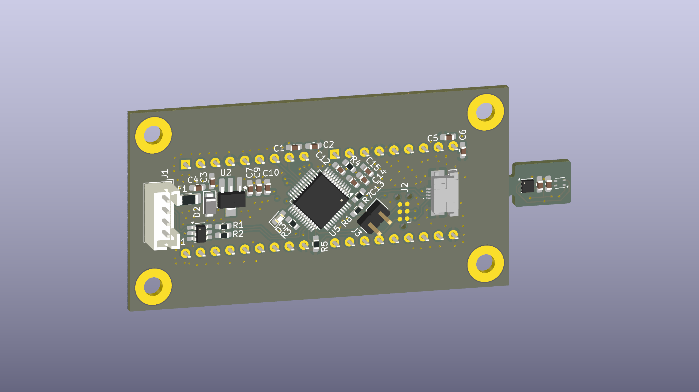

# SDT (SCPI Display Thermometer)
Benchtop thermometer with SCPI and USB.

---
## Status : WIP

- [x] First revision of schematic and PCB is done.
- [x] PCB and parts ordered
- [ ] Prototypes assembled and tested
- [ ] Firmware

---
## Features:
- 4 layer board
- ARM Cortex-M0+ Processor in LQFP48 (STM32C071CBT6) 
- USB 2.0
- TMP117 or/and SHT45 for temperature measurement
----

## License and Contribution

Idea based on [SCPI Capable Thermometer](https://sebastianharnisch.de/scpi-enabled-thermometer/)

Display part & footprint from [kicad-intelligent-displays](https://github.com/74hc595/kicad-intelligent-displays) by [74hc595](https://github.com/74hc595)

[MIT License](/LICENSE)

Open to contributions in both software and hardware!
